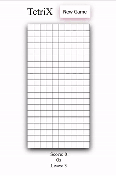

# Tetrix

## Project Description

A close enough version of the popular Tetris game!

Use arrow keys to move the Tetrominoes Left, Right or Down. Use Up arrow to rotate the Tetromino

Fill rows to get score points

You have 3 lives, give it your best!

NB: Cause of the CORS restrictions, you need to use a webserver to run the JS files (Python http, NodeJS http or use VSCode extension Live Preview)

## Screenshot



## How to Run the Project

Steps to run the game in your browser:

```bash
git clone https://github.com/The-Estonian/tetrix

Right click on index.html and Show Preview in Visual Studio Code

```

_<sup>Author: [Jaanus Saar](https://github.com/The-Estonian)_</sup>
